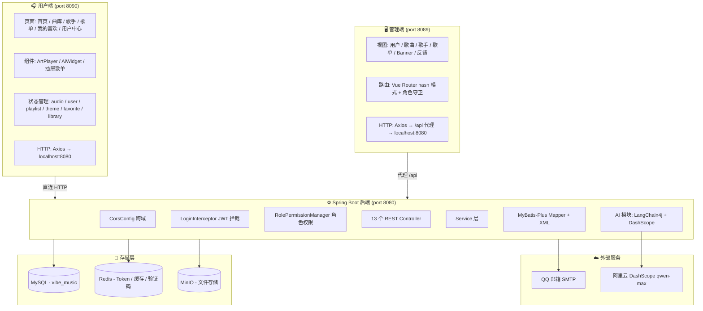
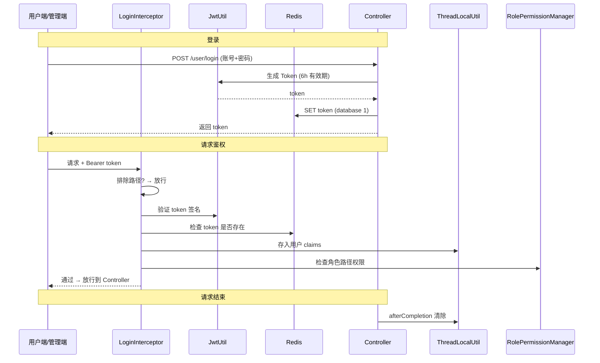
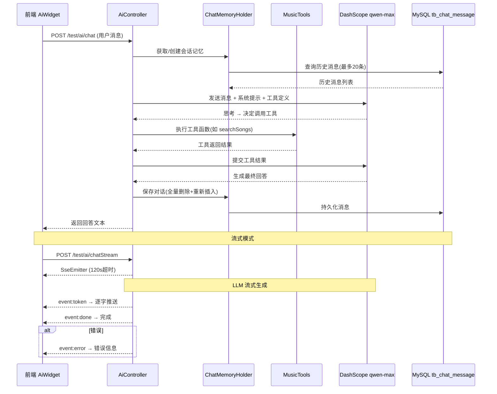
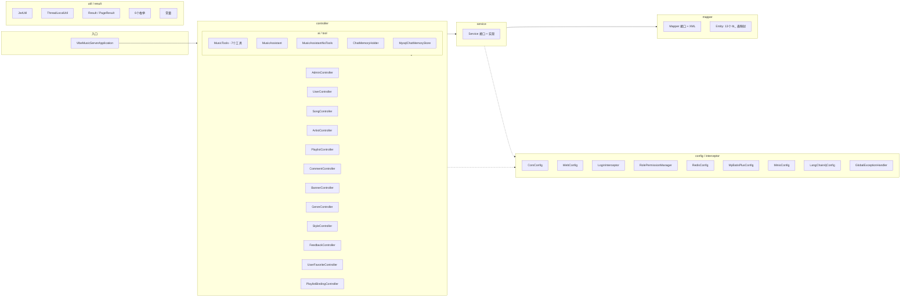
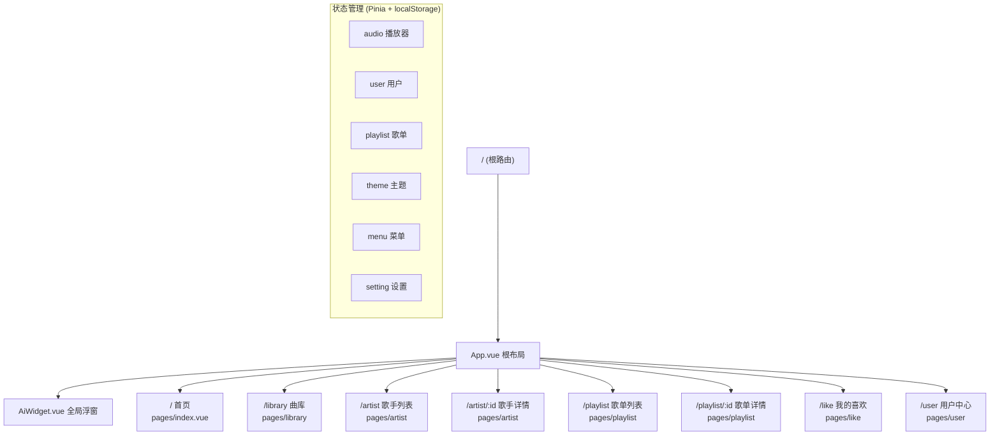

# Vibe Music 🎵

全栈音乐流媒体平台 — 智能推荐、AI 对话、多端管理

## 项目结构

本项目包含三个独立子项目（无父级 POM/工作空间）：

| 子项目 | 类型 | 端口 | 技术栈 |
|---|---|---|---|
| `vibe-music-server/` | Spring Boot 3 后端 | 8080 | Java 17, Maven, MyBatis-Plus, MySQL, Redis, MinIO, LangChain4j |
| `vibe-music-admin/` | 管理端 SPA | 8089 | Vue 3, Vite 6, Pinia, Element Plus, vue-pure-admin |
| `vibe-music-client/` | 用户端 SPA | 8090 | Vue 3, Vite 6, Pinia, Element Plus, ArtPlayer |

## 系统架构图



## 功能特性

### 🎶 音乐管理
- 歌曲、歌单、歌手 CRUD 管理
- 推荐算法（热门推荐、风格推荐）
- 文件上传（MinIO 分布式存储）
- 评论与收藏系统

### 🤖 AI 音乐助手
- 基于 LangChain4j + 阿里云 DashScope（qwen-max）的智能对话
- 7 个工具函数：歌曲搜索、歌手详情、歌单查询、风格检索等
- 流式 SSE 输出，前端逐字渲染
- 对话历史持久化（MySQL + 20 条消息窗口）
- 支持登录用户和游客两种模式

### 🔐 认证与权限
- JWT 令牌认证（有效期 6 小时，Redis 缓存）
- 双角色权限控制（ROLE_ADMIN / ROLE_USER）
- 路径级拦截器 + 通配符放行

### 🖥️ 管理端
- 用户管理、歌曲管理、歌手管理、歌单管理
- 反馈管理、Banner 管理
- 数据看板

### 🎧 用户端
- 音乐播放器（ArtPlayer）
- 曲库浏览、歌单收藏
- 歌手详情
- AI 聊天浮窗

## 认证流程



## AI 对话流程



## 后端包结构



## 用户端页面路由



## 快速开始

### 环境要求

- JDK 17+
- Maven 3.8+
- Node.js 18+
- pnpm 7+
- MySQL 8.0+
- Redis 6+
- MinIO

### 启动后端

```bash
# 1. 导入数据库
cd vibe-music-server/sql
mysql -u root -p < vibe_music.sql

# 2. 配置 application.yml（MySQL、Redis、MinIO、邮箱、DashScope API Key）

# 3. 启动服务
cd vibe-music-server
mvn spring-boot:run
```

### 启动管理端

```bash
cd vibe-music-admin
pnpm install
pnpm dev
```

### 启动用户端

```bash
cd vibe-music-client
pnpm install
pnpm dev
```

## 技术亮点

- **AI 深度集成**：LangChain4j + DashScope，工具调用驱动的音乐领域问答
- **流式响应**：SSE + ReadableStream 实现 AI 回复逐字渲染
- **缓存策略**：Spring Cache + Redis 多级缓存
- **文件存储**：MinIO 分布式对象存储
- **自动导入**：Vite 插件实现 Vue/组件/工具函数自动导入

## 技术栈

| 层 | 技术 |
|---|---|
| 后端框架 | Spring Boot 3.3.7, MyBatis-Plus 3.5.9 |
| 数据库 | MySQL 8.0, Redis |
| 对象存储 | MinIO |
| AI | LangChain4j 0.36.2, DashScope (qwen-max) |
| 认证 | Auth0 java-jwt 4.4.0 |
| 管理端 | Vue 3, Vite 6, Pinia, Element Plus, vue-pure-admin |
| 用户端 | Vue 3, Vite 6, Pinia, Element Plus, ArtPlayer |
| 构建工具 | Maven, pnpm |